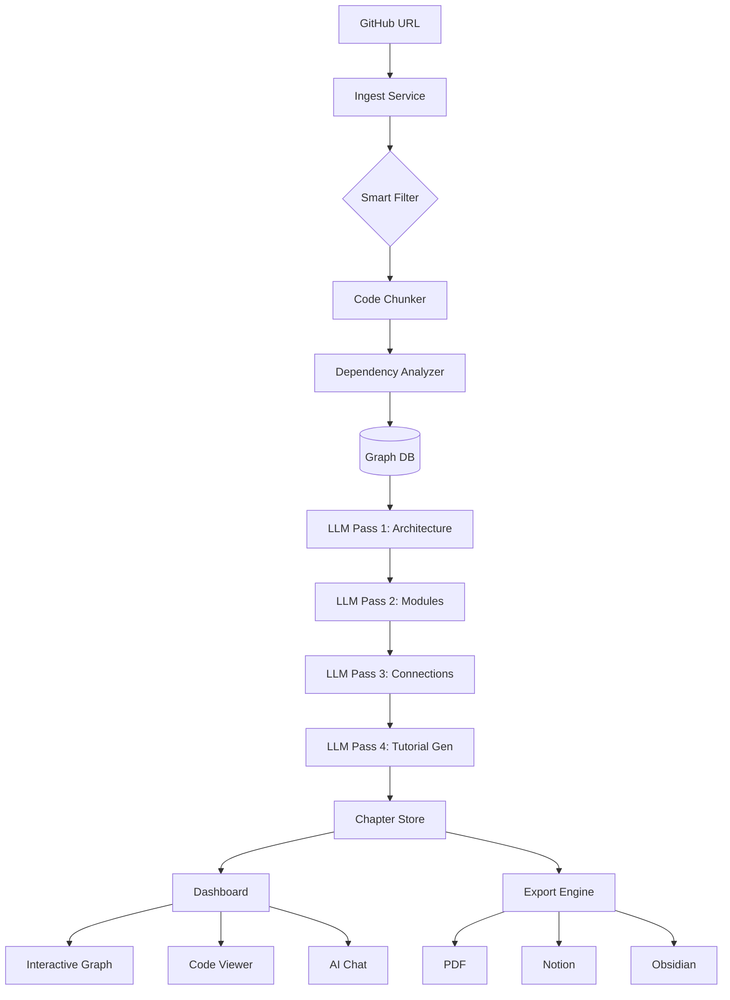

# Codxplica - Features & Roadmap

## Analyse du Systeme Actuel

### Comment ca marche aujourd'hui

```
GitHub URL → Fetch fichiers → LLM identifie abstractions → LLM analyse relations → LLM genere chapitres
```

### Problemes identifies

1. **Decouverte superficielle** - Le systeme liste les fichiers mais ne comprend pas vraiment l'architecture
2. **Chapitres generiques** - Les tutoriels parlent de "User", "Project", "Chapter" de maniere abstraite
3. **Pas de code reel** - Les exemples de code sont inventes au lieu d'utiliser le vrai code du repo
4. **Pas de navigation intelligente** - On ne suit pas le flux logique du code
5. **Taille limitee** - Les gros repos ne sont pas bien geres

---

## Features a Developper

### Phase 1: Amelioration du Parsing

#### 1.1 Smart File Filtering
```
- [ ] Ignorer les fichiers de config (package.json, tsconfig, etc.)
- [ ] Prioriser les fichiers sources principaux
- [ ] Detecter le framework utilise (Next.js, Express, Django, etc.)
- [ ] Identifier le point d'entree de l'app
```

#### 1.2 Code Chunking Intelligent
```
- [ ] Decouper les gros fichiers en sections logiques
- [ ] Extraire les fonctions/classes importantes
- [ ] Garder le contexte entre les chunks
- [ ] Limite de tokens par chunk (pour les LLM)
```

#### 1.3 Dependency Graph
```
- [ ] Analyser les imports/exports
- [ ] Creer un graphe de dependances
- [ ] Identifier les modules centraux vs peripheriques
- [ ] Visualiser avec Mermaid
```

### Phase 2: Amelioration de l'Analyse LLM

#### 2.1 Multi-Pass Analysis
```
- [ ] Pass 1: Vue d'ensemble de l'architecture
- [ ] Pass 2: Analyse detaillee de chaque module
- [ ] Pass 3: Connexions et flux de donnees
- [ ] Pass 4: Generation des tutoriels
```

#### 2.2 Prompts Specialises par Type de Projet
```
- [ ] Template pour API REST
- [ ] Template pour Frontend React/Next.js
- [ ] Template pour CLI tools
- [ ] Template pour Libraries
- [ ] Detection automatique du type
```

#### 2.3 Code Snippets Reels
```
- [ ] Inclure le vrai code du repo dans les chapitres
- [ ] Annotations ligne par ligne
- [ ] Liens vers les fichiers sources
- [ ] Syntax highlighting par langage
```

### Phase 3: UI/UX Ameliorations

#### 3.1 Dashboard Interactif
```
- [ ] Graphe visuel des abstractions (D3.js ou vis.js)
- [ ] Navigation entre concepts cliquable
- [ ] Preview du code en hover
- [ ] Mode sombre/clair
```

#### 3.2 Export Options
```
- [ ] Export PDF (livre complet)
- [ ] Export Notion
- [ ] Export Obsidian (vault)
- [ ] Export GitBook
- [ ] Export Docusaurus
```

#### 3.3 Personnalisation
```
- [ ] Choix du niveau (debutant/intermediaire/expert)
- [ ] Choix de la langue (FR/EN/ES/etc.)
- [ ] Style d'ecriture (formel/casual/technique)
- [ ] Focus sur certains aspects (architecture/API/tests)
```

### Phase 4: Features Avancees

#### 4.1 Incremental Updates
```
- [ ] Detecter les changements depuis la derniere analyse
- [ ] Mettre a jour seulement les chapitres affectes
- [ ] Historique des versions du tutoriel
```

#### 4.2 AI Chat Integration
```
- [ ] Chat avec le codebase (RAG)
- [ ] Poser des questions sur le code
- [ ] Generer des explications a la demande
- [ ] Mode "pair programming"
```

#### 4.3 Collaboration
```
- [ ] Partage de projets
- [ ] Commentaires sur les chapitres
- [ ] Contributions communautaires
- [ ] Teams/Organizations
```

---

## Priorites Immediates

### Sprint 1 (Cette semaine)

| Priorite | Feature | Effort |
|----------|---------|--------|
| P0 | Fix OpenRouter 401 | 1h |
| P0 | Test endpoint /api/test-openrouter | Done |
| P1 | Smart File Filtering | 4h |
| P1 | Vrai code dans les chapitres | 4h |
| P2 | Dependency Graph basique | 6h |

### Sprint 2 (Semaine prochaine)

| Priorite | Feature | Effort |
|----------|---------|--------|
| P1 | Multi-Pass Analysis | 8h |
| P1 | Prompts specialises | 4h |
| P2 | Export PDF | 4h |
| P2 | Graphe visuel D3.js | 8h |

---

## Architecture Cible



---

## Modeles OpenRouter Recommandes

| Modele | Use Case | Gratuit |
|--------|----------|---------|
| `deepseek/deepseek-r1:free` | Analyse complexe, reasoning | Oui |
| `meta-llama/llama-3.3-70b-instruct:free` | Generation longue | Oui |
| `qwen/qwen-2.5-72b-instruct:free` | Code understanding | Oui |
| `google/gemma-2-9b-it:free` | Tasks rapides | Oui |

---

## Notes Techniques

### Limites Actuelles
- GitHub API rate limit: 60 req/h (sans token), 5000 req/h (avec token)
- Vercel timeout: 60s (Pro), 10s (Hobby)
- OpenRouter free tier: Rate limited
- Context window: Varie selon le modele

### Solutions
- Caching agressif des repos
- Streaming responses
- Background jobs pour gros repos
- Fallback entre modeles

---

## Changelog

### v0.2.0 (En cours)
- [x] Integration OpenRouter
- [x] Selection provider/modele dans UI
- [ ] Test endpoint
- [ ] Smart filtering

### v0.1.0 (Initial)
- [x] Integration Gemini
- [x] Generation tutoriels basique
- [x] Dashboard React
- [x] Prisma + PostgreSQL
