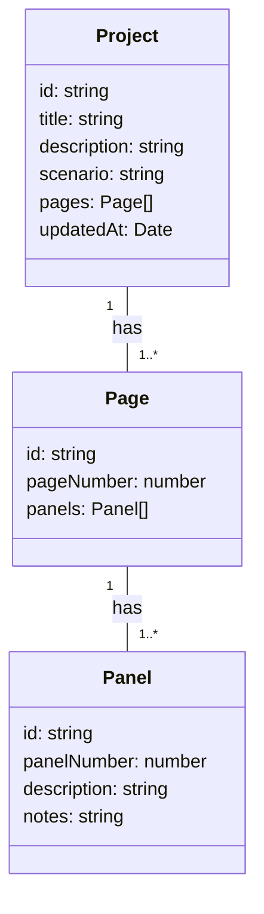

# Project: Your Manga Management System - Chapter 1: Setting Up the Foundation

Welcome to "Project," your personal manga management system! In this tutorial, we'll walk you through building a tool that allows you to organize and develop your manga series, from initial plot ideas to detailed panel layouts. Think of "Project" as a digital binder where you keep everything related to your manga creation process.

This first chapter will focus on setting up the initial project structure and understanding the core concept of a "Project" within our application.

**What is a "Project"?**

At its heart, a "Project" represents your entire manga series. It's a container that holds all the crucial information about your story, including:

*   **Scenario:** The plot, character details, world-building notes, and overall storyline.
*   **Visual Layout:** The pages and panels, their arrangement, and the visual storytelling elements.

Essentially, it's everything you need to develop your manga from start to finish, all neatly organized in one place.  We'll also keep track of the `updatedAt` timestamp for each Project, letting us know when it was last modified.

**Our Project Structure**

We'll be using React and TypeScript to build "Project." Let's break down the files we'll be working with:

*   `App.tsx`:  The main application component, responsible for rendering the overall UI and managing the currently selected Project.
*   `types.ts`:  This file will define the TypeScript types for our data, ensuring type safety throughout our application. Specifically, we'll define the `Project` type here.
*   `components/MangaBoard.tsx`: This component will display the individual pages and panels of your manga. Think of it as a digital storyboard.
*   `components/Checklist.tsx`: This component will allow us to track the progress of our manga development, with features like script completion, character design, and paneling.

**Defining the `Project` Type (in `types.ts`)**

Let's start by defining the structure of our `Project` object in `types.ts`.

```typescript
// types.ts
export interface Project {
  id: string; // Unique identifier for the project
  title: string; // Title of the manga
  description: string; // Brief description of the story
  scenario: string; // Detailed scenario/plot outline (Markdown format)
  pages: Page[]; // Array of pages in the manga
  updatedAt: Date; // Timestamp of last update
}

export interface Page {
  id: string; // Unique identifier for the page
  pageNumber: number; // Page number
  panels: Panel[]; // Array of panels in the page
}

export interface Panel {
  id: string; // Unique identifier for the panel
  panelNumber: number; // Panel number within the page
  description: string; // Description of what happens in this panel (Markdown format)
  notes: string; // Any additional notes or references for this panel
}
```

**Explanation:**

*   `id`:  A unique string to identify each project. We'll likely use a UUID generator for this.
*   `title`:  The name of your manga series.
*   `description`:  A short summary of what your manga is about.
*   `scenario`:  This field will hold the core story of your manga. We'll use Markdown to allow for formatted text, headings, lists, and more.
*   `pages`:  An array of `Page` objects. Each page contains an array of `Panel` objects.  This allows us to build the visual structure of our manga.
*   `updatedAt`:  A `Date` object representing the last time the project was modified. This is crucial for keeping track of changes.

**Visualizing the Project Structure**

We can use a Mermaid diagram to visualize the relationship between the different data structures:



**Next Steps**

In the following chapters, we'll focus on:

*   Setting up the initial UI in `App.tsx` and displaying a basic Project.
*   Creating the `MangaBoard` component to visualize pages and panels.
*   Implementing the `Checklist` component for tracking progress.
*   Adding functionality to create, edit, and delete Projects.

By the end of this tutorial, you'll have a functional manga management system that you can customize to fit your specific needs!
