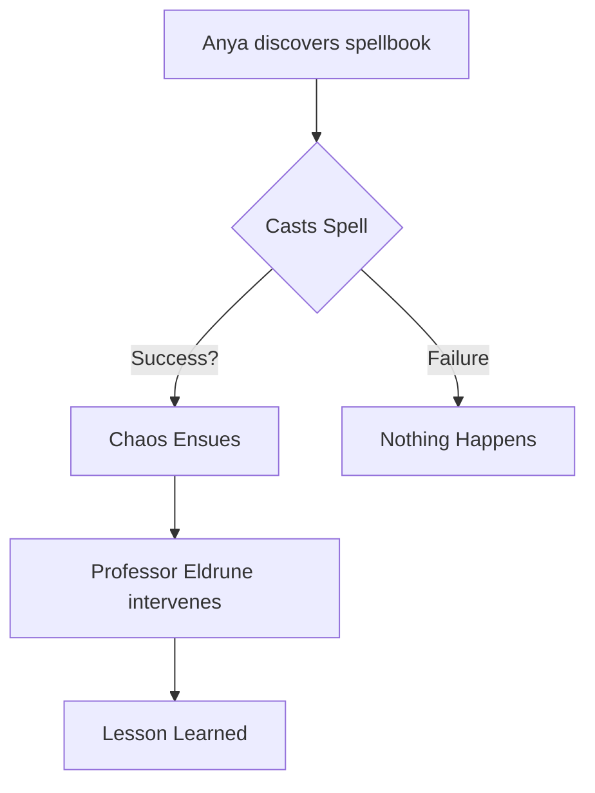

Okay, here's Chapter 2 of the "ScenarioData" tutorial, focusing on how to define and structure your initial story ideas.

## Chapter 2: Structuring Your Story Ideas with ScenarioData

In the previous chapter, we introduced the concept of "ScenarioData" and its role in laying the foundation for your manga. Now, let's dive into how you can use it to actually structure your initial story ideas. Think of this as brainstorming and organizing your thoughts before you start drawing.

**The Importance of Structure**

Before we jump into the code, it's crucial to understand *why* structure is so important. A well-defined ScenarioData object helps you:

*   **Maintain Focus:**  You have a clear document to refer to, preventing story drift.
*   **Organize Thoughts:** Break down a complex story into manageable pieces.
*   **Facilitate Collaboration:**  If you're working with a team, everyone is on the same page.
*   **Improve Efficiency:** Having a well-defined plan speeds up the drawing and editing process.

**Defining the Basic ScenarioData Structure**

Let's revisit the basic structure of our `ScenarioData` type (assuming it's defined in `types.ts`):

```typescript
// types.ts
interface ScenarioData {
  title: string;
  theme: string;
  characters: Character[];
  plotSummary: string;
  chapterOutline: ChapterOutline[];
  dialogues: Dialogue[];
  coverDescription: string;
  notes: string;
  // ... other properties as needed
}

interface Character {
  name: string;
  description: string;
  personality: string;
  role: string; // Protagonist, Antagonist, Supporting
  // ... other properties
}

interface ChapterOutline {
  chapterNumber: number;
  title: string;
  summary: string;
  keyEvents: string[];
  // ... other properties
}

interface Dialogue {
  characterName: string;
  chapterNumber: number;
  panelNumber: number;
  dialogueText: string;
}

// ... more interfaces as needed
```

*Note: This is a simplified example. Your actual `ScenarioData` type might have more properties depending on your needs.*

**Breaking Down the Properties:**

*   **`title`:** The title of your manga chapter.
*   **`theme`:**  The overarching message or idea you want to convey.  Examples: "Friendship conquers all," "The dangers of unchecked power," "Finding your place in the world."
*   **`characters`:** An array of character objects.  Each character object will define crucial attributes.
*   **`plotSummary`:** A brief summary (1-2 paragraphs) of the entire chapter's plot. This is your "elevator pitch."
*   **`chapterOutline`:** An array of `ChapterOutline` objects. This is more detailed than the `plotSummary`, but still high-level. Each `ChapterOutline` breaks down the chapter into scenes or acts.
*   **`dialogues`:** An array of `Dialogue` objects.  This is where you jot down important lines of dialogue that come to mind.
*   **`coverDescription`:**  A description of what you envision for the chapter's cover art.
*   **`notes`:**  A free-form section for any additional thoughts, ideas, or references.

**Example: Populating ScenarioData with Initial Ideas**

Let's say you're creating a chapter for a manga about a magical school.  Here's how you might start populating your `ScenarioData`:

```typescript
// In your App.tsx or ScenarioWizard.tsx, where you manage ScenarioData
const initialScenarioData: ScenarioData = {
  title: "The Lost Spellbook",
  theme: "The importance of research and responsibility in magic.",
  characters: [
    {
      name: "Anya",
      description: "A bright but impulsive first-year student.",
      personality: "Enthusiastic, curious, and a bit reckless.",
      role: "Protagonist",
    },
    {
      name: "Professor Eldrune",
      description: "A wise but stern professor of Ancient Runes.",
      personality: "Calm, knowledgeable, and demanding.",
      role: "Supporting",
    },
  ],
  plotSummary: "Anya accidentally discovers a forbidden spellbook in the library and attempts to use its powerful spells without understanding the consequences.  She causes a magical mishap that endangers the school and must work with Professor Eldrune to fix it, learning a valuable lesson about responsibility.",
  chapterOutline: [
    {
      chapterNumber: 1,
      title: "The Forbidden Section",
      summary: "Anya explores the restricted section of the library and finds the spellbook.",
      keyEvents: ["Anya enters the library", "She finds the forbidden section", "She discovers the spellbook hidden behind a shelf"],
    },
    {
      chapterNumber: 2,
      title: "Unleashing Chaos",
      summary: "Anya tries a spell from the book, with disastrous results.",
      keyEvents: ["Anya tries a spell in her dorm", "The spell goes wrong", "Magical chaos ensues in the school"],
    },
  ],
  dialogues: [
    {
      characterName: "Anya",
      chapterNumber: 2,
      panelNumber: 5,
      dialogueText: "Oops... maybe I shouldn't have used *that* spell.",
    },
  ],
  coverDescription: "Anya standing amidst magical chaos, a glowing spellbook in her hands, looking both excited and scared.",
  notes: "Consider adding a humorous sidekick character. Research different types of magical mishaps.",
};

// ... (rest of your component logic)
```

**Using Mermaid Diagrams for Visualization**

You can use Mermaid diagrams to visualize character relationships or plot flow. For example, to visualize the plot:

```markdown


**ScenarioWizard Component Integration**

Assuming you have a `ScenarioWizard` component (as mentioned in the file list), this is where you'll likely implement the user interface for filling out and editing the `ScenarioData`.

This component would handle:

*   Displaying input fields for each `ScenarioData` property.
*   Allowing the user to add and remove characters, chapter outlines, and dialogues.
*   Updating the `ScenarioData` state as the user types.

**(Next Steps in ScenarioWizard.tsx would be creating input fields for each of these properties and updating the state based on user input)**

**Key Takeaways:**

*   Start by defining the core properties of your `ScenarioData` object.
*   Populate these properties with your initial story ideas, even if they're rough.
*   Use the `chapterOutline` to break down your chapter into manageable scenes.
*   Use the `notes` section for any additional thoughts or reminders.
*   Consider using Mermaid diagrams to visually represent aspects of your story.

In the next chapter, we'll explore how to use the `AiChat` component (mentioned in the file list) to further refine your `ScenarioData` by getting help from AI. This could be used for brainstorming, dialogue generation, or even refining your plot summary.
