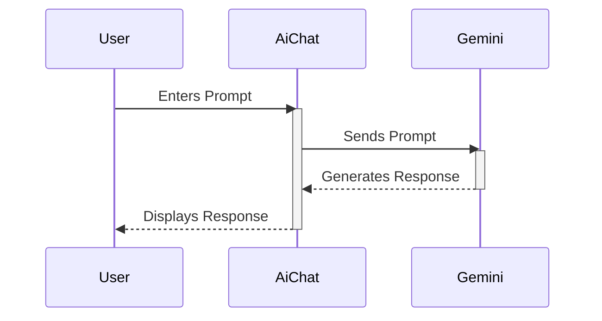

Okay, here's Chapter 6 of the "AiChat" tutorial, focusing on how to actually use the component and get the most out of it.

```markdown
# Chapter 6: Unleashing the Power of AiChat

In previous chapters, we've built and understood the underlying structure of our `AiChat` component. Now, it's time to dive into the exciting part: actually *using* it to generate content and boost your creativity!

This chapter will cover:

*   Basic interaction: Sending prompts and receiving responses.
*   Crafting effective prompts: Tips and tricks for better results.
*   Example use cases: Applying AiChat to common writing tasks.
*   Advanced prompting techniques (brief overview).

## 1. Basic Interaction: Chatting with the AI

Remember our `AiChat.tsx` component?  It presents a chat interface. The core interaction loop is simple:

1.  **You type a prompt** into the input field.  This is your question or request to the AI.
2.  **You submit the prompt** (usually by pressing Enter or clicking a "Send" button).
3.  **AiChat sends the prompt to the AI model (Gemini).**
4.  **Gemini generates a response based on your prompt.**
5.  **AiChat displays the response** in the chat history.

Here's a simplified visual representation:



**Example:**

Let's say you're writing a fantasy novel. You might type the following prompt into the `AiChat` input:

`"Brainstorm some unique creature ideas for a dark forest."`

After submitting, AiChat will send this to Gemini, which will process it and (hopefully!) return a list of creature ideas. These will then be displayed in your chat history.

## 2. Crafting Effective Prompts: Getting the Best Results

The quality of the AI's response depends heavily on the quality of your prompt.  Here are some tips:

*   **Be specific:**  Avoid vague requests like "Write a story."  Instead, try "Write a short story about a robot who learns to paint."  The more specific you are, the better the AI can understand your needs.
*   **Provide context:**  Give the AI enough background information to understand what you're looking for.  For example, instead of "Describe a character," try "Describe a young, ambitious thief in a steampunk setting."
*   **Set the tone:**  Tell the AI what kind of tone you want.  For example, "Write a humorous description of a wizard" or "Write a serious and dramatic monologue for a king."
*   **Specify the format:**  If you need the output in a specific format (e.g., a list, a poem, a script), tell the AI.  For example, "Give me a list of five plot points for a murder mystery novel."
*   **Iterate:** Don't be afraid to refine your prompts based on the AI's responses. If you don't like the first result, try rephrasing your prompt or providing more information.

**Example Prompt Comparison:**

*   **Bad:** "Write a description." (Too vague)
*   **Better:** "Write a description of a futuristic city, focusing on its architecture and technology, using a cyberpunk aesthetic." (More specific, provides context)

## 3. Example Use Cases: Applying AiChat to Writing Tasks

Here are a few examples of how you can use AiChat to help with different writing tasks:

*   **Brainstorming:**  "Brainstorm ideas for a science fiction short story."
*   **Character Development:** "Describe a flawed but likeable protagonist."
*   **Worldbuilding:** "Generate ideas for the history of a magical kingdom."
*   **Plot Development:** "Outline the key plot points of a thriller novel."
*   **Dialogue:** "Write a short conversation between two characters arguing about a philosophical issue."
*   **Overcoming Writer's Block:** "Give me some opening lines for a novel about a time traveler."

Experiment with different prompts and see what AiChat can come up with!

## 4. Advanced Prompting Techniques (Brief Overview)

While we won't delve deeply into this now, here are a few more advanced prompting techniques you might want to explore later:

*   **Few-shot learning:** Provide the AI with a few examples of the style or format you want.
*   **Chain-of-thought prompting:**  Encourage the AI to explain its reasoning process step-by-step, leading to more accurate and insightful responses.
*   **Role-playing:**  Ask the AI to assume the role of a specific character or expert.

These techniques can significantly improve the quality of the AI's output, but they require more careful planning and experimentation.

## Conclusion

This chapter has given you a practical introduction to using AiChat. By crafting effective prompts and experimenting with different use cases, you can harness the power of AI to enhance your writing process and unlock your creative potential. In the next chapter, we'll look at how to customize the look and feel of the AiChat component to better integrate it into your application.
```
