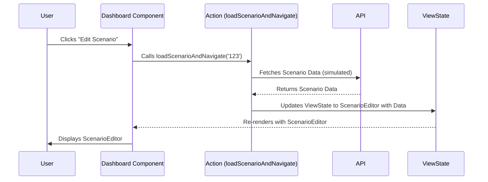

Okay, let's craft Chapter 7 of the "ViewState" tutorial.

# Chapter 7: Handling Complex State Transitions with Actions

So far, we've seen how to directly update the `viewState` using `setView`. This works well for simple transitions. However, as your application grows, you'll likely encounter more complex scenarios where multiple state updates are required, or where logic needs to be executed before or after a state change.  This is where **Actions** come in.

**What are Actions?**

Actions are functions that encapsulate the logic for transitioning between view states. They provide a central place to manage state updates and side effects. This makes your code more organized, testable, and easier to reason about.

**Why use Actions?**

*   **Centralized Logic:** All state transition logic lives in one place, making it easier to find, modify, and debug.
*   **Testability:** Actions are functions, which are easily testable in isolation.
*   **Composability:** You can chain actions together or trigger them in response to other actions.
*   **Side Effects:** Actions can easily handle side effects like API calls or local storage updates before or after a state change.

**Example:  Moving to the Scenario Editor with Data Loading**

Let's say we want to transition to the `ScenarioEditor` view, but *before* we transition, we need to fetch the scenario data from an API.

1.  **Define the Action:**

    In `App.tsx`, let's add an action to handle this:

    ```typescript jsx
    // App.tsx
    import React, { useState } from 'react';
    import { ViewState, setView } from './types';

    function App() {
        const [viewState, setViewState] = useState<ViewState>({ type: 'Dashboard' });

        const loadScenarioAndNavigate = async (scenarioId: string) => {
            // Simulate API call
            console.log(`Loading scenario ${scenarioId}...`);
            await new Promise(resolve => setTimeout(resolve, 500)); // Simulate delay

            const scenarioData = { id: scenarioId, name: `Scenario ${scenarioId}`, description: "A sample scenario." };  // Replace with actual API data

            setView(setViewState, {
                type: 'ScenarioEditor',
                scenario: scenarioData,
            });

            console.log(`Scenario ${scenarioId} loaded and navigated to ScenarioEditor.`);
        };

        const renderView = () => {
            switch (viewState.type) {
                case 'Dashboard':
                    return (
                        <div>
                            <h2>Dashboard</h2>
                            <button onClick={() => loadScenarioAndNavigate('123')}>Edit Scenario 123</button>
                            <button onClick={() => setView(setViewState, { type: 'Storyboard' })}>Go to Storyboard</button>
                        </div>
                    );
                case 'ScenarioEditor':
                    return (
                        <div>
                            <h2>Scenario Editor</h2>
                            <p>Editing Scenario: {viewState.scenario.name}</p>
                            <button onClick={() => setView(setViewState, { type: 'Dashboard' })}>Back to Dashboard</button>
                        </div>
                    );
                case 'Storyboard':
                    return (
                        <div>
                            <h2>Storyboard</h2>
                            <button onClick={() => setView(setViewState, { type: 'Dashboard' })}>Back to Dashboard</button>
                        </div>
                    );
                default:
                    return <div>Unknown View</div>;
            }
        };

        return (
            <div>
                {renderView()}
            </div>
        );
    }

    export default App;
    ```

2.  **Update `types.ts`:**

    We need to update the `ViewState` type definition to include the `scenario` property in the `ScenarioEditor` view:

    ```typescript
    // types.ts
    export type ViewState =
      | { type: 'Dashboard' }
      | { type: 'ScenarioEditor'; scenario: { id: string; name: string; description: string; } }
      | { type: 'Storyboard' };

    export const setView = (
        setViewState: React.Dispatch<React.SetStateAction<ViewState>>,
        newViewState: ViewState
    ) => {
        setViewState(newViewState);
    };
    ```

**Explanation:**

*   `loadScenarioAndNavigate` is our action.  It takes a `scenarioId` as input.
*   Inside the action, we simulate an API call using `await new Promise(resolve => setTimeout(resolve, 500))`.  Replace this with your actual API call.
*   Once the data is fetched (or simulated), we call `setView` to update the `viewState` to `ScenarioEditor` and pass the fetched `scenarioData`.
*   On the Dashboard, the button now calls the `loadScenarioAndNavigate` action.
*   We added a new property `scenario` to the `ScenarioEditor`'s `ViewState`.

**Mermaid Diagram**

Here's a diagram illustrating the flow:



**Benefits:**

*   The logic for loading the scenario data is contained within the `loadScenarioAndNavigate` function, making it easy to modify or test.
*   The component that triggers the transition doesn't need to know *how* the data is loaded; it just calls the action.
*   We can easily add error handling (e.g., display an error message if the API call fails) within the action.

**Next Steps:**

*   **Error Handling:**  Add error handling to your actions to gracefully handle failures.
*   **Action Payloads:** Pass more complex data to your actions as needed.
*   **Middleware:**  Consider using middleware patterns for actions to intercept and modify state transitions.  This is an advanced topic, but it can be helpful for things like logging or authentication.
*   **Testing:**  Write unit tests for your actions to ensure they are working correctly.

This chapter provides a fundamental introduction to actions for ViewState management. As your application grows, embracing actions will greatly improve the maintainability and scalability of your state management. Remember to replace the simulated API call with your actual API calls and tailor the actions to suit your specific application's needs.
